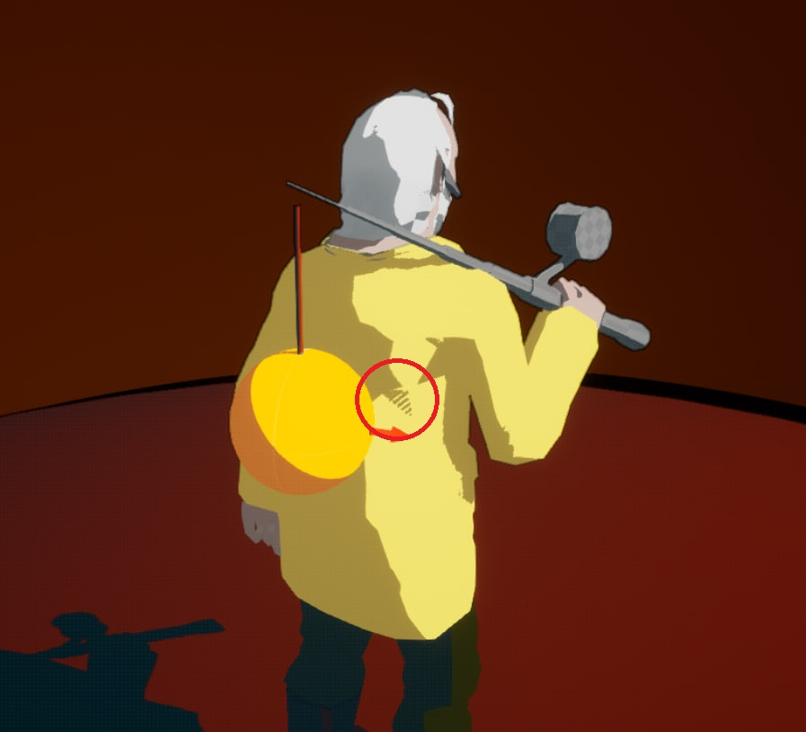

# Shadows

## Virtual shadows
I noticed they were enabled by default in unreal engine 5.1. 



They are good for smooth shadowing but I'm using a celshading postprocess and they were causing weird jagged glitches.
Change them by selecting the `shadow maps` option in the project settings (by default will be set `virtual shadow maps (Beta)`):
``` 
Project setting 
    -> Engine 
    -> Rendering 
    -> Shadows 
        -> Shadow map method 
            -> shadow maps -> [shadow maps]
```
